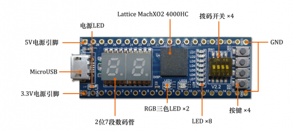
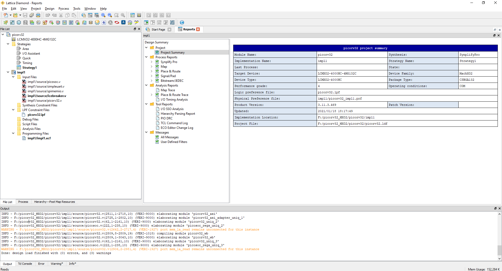
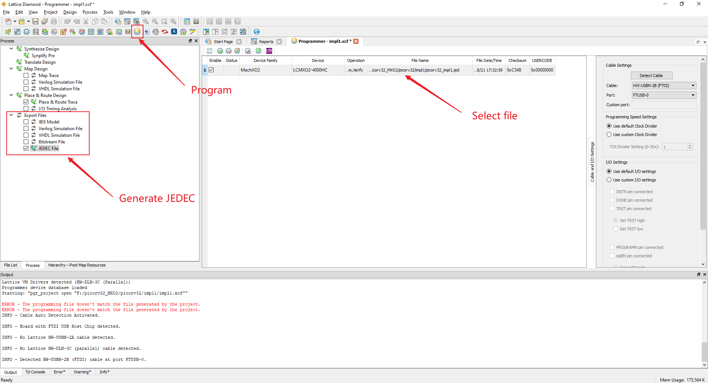
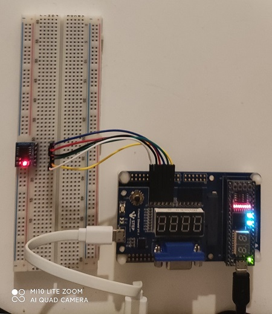

# Picorv32 on Lattice MXO2
```
  ____  _          ____         ____
 |  _ \(_) ___ ___/ ___|  ___  / ___|
 | |_) | |/ __/ _ \___ \ / _ \| |
 |  __/| | (_| (_) |__) | (_) | |___
 |_|   |_|\___\___/____/ \___/ \____|
```

## Step 0: Prerequisites

- Lattice Diamond
- [riscv32-unknown-elf-gcc](https://pingu98.wordpress.com/2019/04/08/how-to-build-your-own-cpu-from-scratch-inside-an-fpga/)
- SPI Nor Flash (1MB at least)



## Step 1: Upload bitstream

Open the project file **picorv32/picorv32.ldf** in Lattice Diamond:



Generate bitstream and upload:




## Step 2: Flash firmware

Compile the firmware using **riscv32-unknown-elf-gcc** on **PC**:

```
$ cd firmware
$ make
```

Connect the SPI Nor Flash with Raspberry Pi:

```
- FLASH (VCC) --> Pi  (3V3)
- FLASH (GND) --> Pi  (GND)
- FLASH (CLK) --> Pi (SCLK)
- FLASH  (CS) --> Pi  (CS0)
- FLASH  (DI) --> Pi (MISO)
- FLASH  (DO) --> Pi (MOSI)
```

On **Raspberry Pi**:

```
$ make upload
```


## Step 3: Run

Connect the SPI Nor Flash with MXO2 FPGA:

```
- FLASH  (VCC) --> MXO2  (3V3)
- FLASH  (GND) --> MXO2  (GND)
- FLASH  (CLK) --> MXO2  (P13)
- FLASH   (CS) --> MXO2   (P3)
- FLASH   (DI) --> MXO2   (N4)
- FLASH   (DO) --> MXO2   (M4)
- USB TTL (RX) --> MXO2   (E3)
- USB TTL (TX) --> MXO2   (F3)
```

The serial port should print:


```
Press ENTER to continue..

____  _          ____         ____
 |  _ \(_) ___ ___/ ___|  ___  / ___|
 | |_) | |/ __/ _ \___ \ / _ \| |
 |  __/| | (_| (_) |__) | (_) | |___
 |_|   |_|\___\___/____/ \___/ \____|

Total memory: 0 KiB

Running memtest ..... passed

SPI State:
  LATENCY 8
  DDR OFF
  QSPI OFF
  CRM OFF


Select an action:

   [1] Read SPI Flash ID
   [2] Read SPI Config Regs
   [3] Switch to default mode
   [4] Switch to Dual I/O mode
   [5] Switch to Quad I/O mode
   [6] Switch to Quad DDR mode
   [7] Toggle continuous read mode
   [9] Run simplistic benchmark
   [0] Benchmark all configs
   [M] Run Memtest
   [S] Print SPI state
   [e] Echo UART

Command> 
```



### Helpful Resources

- [Setting up the toolchain](https://pingu98.wordpress.com/2019/04/08/how-to-build-your-own-cpu-from-scratch-inside-an-fpga/)


### Related Projects

- [Picorv32 on MXO2 (Baremetal)](https://github.com/wuhanstudio/picorv32_MXO2)
- [Picorv32 on Lichee Tang (RT-Thread)](https://github.com/wuhanstudio/picorv32_tang)
- [HBird_E203 on Lichee Tang (RT-Thread)](https://github.com/wuhanstudio/hbird_e203_tang)
